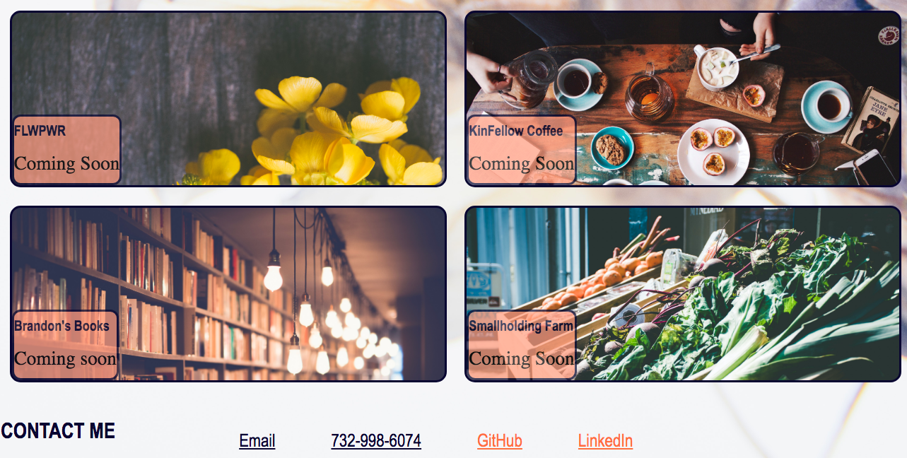

# Portfolio

Purpose of this project was to develop a portfolio that satisfies a typical hiring manager’s needs:
- the developer's name, a recent photo, and links to sections about them, their work, and how to contact them
- the links in the navigation have UI scroll to the corresponding section
- the work section includes titled images of the developer's applications
- the developer's first application is larger in size than the others
- clicking on the images of the applications will direct to a deployed application
- viewing the site on various screens and devices, the user is presented with a responsive layout that adapts to their viewport

# Preview

# Link
